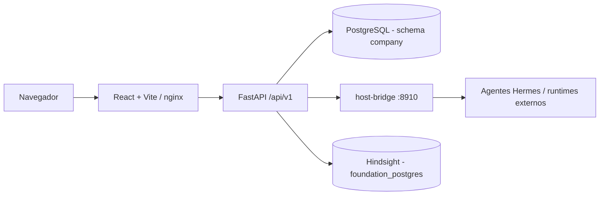

<p align="center">
  
</p>

<p align="center">
  <strong>Plano de controle para planejar, governar e executar projetos de software com agentes de IA.</strong>
</p>

<p align="center">
  <a href="#visao-geral">Visão Geral</a> ·
  <a href="#principais-funcionalidades">Funcionalidades</a> ·
  <a href="#arquitetura">Arquitetura</a> ·
  <a href="#tecnologias">Tecnologias</a> ·
  <a href="#instalação">Instalação</a> ·
  <a href="#documentação">Documentação</a>
</p>

---

## Visão Geral

ForgeHub é o plano de controle que substitui a antiga stack "Hermes Agent Forge" para planejar, governar e executar projetos de software conduzidos por agentes de IA. O produto registra produtos/versões/projetos, define estágios de pipeline com artefatos obrigatórios e gates de aprovação, quebra itens de planejamento (features, bugs etc.) em tasks, despacha essas tasks para agentes executores e mantém uma trilha de auditoria ligando cada entidade de volta a uma versão de produto.

O invariante central do domínio: nenhuma feature, bug, task, skill, execução ou artefato pode existir sem vínculo a produto, versão, projeto, planejamento, pipeline, responsável, status, trilha de auditoria e critérios de validação. A maior parte das tabelas existe para preservar essa cadeia de rastreabilidade, não apenas para armazenar dados.

Toda comunicação e execução de tasks entre agentes acontece por um único canal — **Messages** (`company.agent_demands`) — acessível pela tela do produto, por um MCP server dedicado (`forgehub-messages`) ou pelo script `send_agent_message.sh`. Não há mais integração com ferramentas externas de board de tarefas (Kanboard foi descontinuado e removido do código em 2026-07-28).

Na composição manual, **De (agente)** identifica obrigatoriamente o agente responsável pela mensagem. **Para** pode ficar em branco: nesse caso, o trabalho é endereçado ao próprio agente de **De**. O tipo é sempre explícito e limitado a `Task` ou `Incubation`; uma `Task` sem destinatário informado usa o remetente como destinatário e recebe agendamento imediato quando nenhum horário é escolhido.

## Principais Funcionalidades

- **Governança de produto e pipeline** — cadastro de produtos, versões e projetos; definição de estágios de pipeline com artefatos obrigatórios e gates de aprovação antes de avançar o trabalho.
- **Rastreabilidade planejamento → execução** — quebra de features/bugs em tasks, atribuição a agentes, dependências entre tasks (gate de bloqueio no dispatch) e telemetria de execução por agente.
- **Cockpit Produto → Projeto** — árvore agregada com as cinco fases da Fábrica de Software (Conceito, System Map, Backlog/Planejamento, Tasks, Governance) e custo por projeto.
- **Canal Messages (agente ↔ agente e execução de task)** — todo dispatch de task passa pelo mesmo canal de mensagens, com timeout de despacho, teto de concorrência, reprocessamento manual de falhas e feedback opcional por Telegram.
- **Incubação** — mensagens sem execução imediata ficam "estacionadas" até o agente dono decidir recebê-las (viram Task) ou descartá-las, com prazo de maturação automático.
- **Registro de agentes** — agentes executores/coordenadores, sub-agentes, skills, credenciais de serviço revogáveis, arquivos de perfil (SOUL.md/IDENTITY.md/...), servidores MCP por runtime e status do canal Telegram.
- **Trilha de auditoria e governança** — aprovações e eventos de auditoria como entidades de primeira classe, com referência polimórfica (entity_type/entity_id).
- **Inbox/Docs/Chat** — canal de intake convertível em task/doc/artefato/planning item; área de documentação em Markdown; chat com streaming SSE para os agentes Hermes.
- **Ferramentas operacionais** — cron jobs, scripts, exploração de banco de dados, status do Hindsight (memória), controle de Git/sistema e inventário de servidores (com cofre de chaves SSH cifrado).

## Arquitetura

```text
Frontend (React/Vite)
   │  fetch same-origin (VITE_API_URL || window.location.origin)
   ▼
Backend (FastAPI, /api/v1/*)
   │
   ├── PostgreSQL "company" schema (company_postgres:5433) — dados do ForgeHub
   ├── PostgreSQL "foundation" (foundation_postgres:5432) — dados internos Hermes/Hindsight
   ├── host-bridge (systemd, :8910) — proxy para processos Hermes reais no host
   │      ├── chat streaming (SSE) e execução de agentes
   │      └── gateway de mensageria cross-channel (Telegram/Discord/Slack)
   └── Hindsight — memória semântica coletiva (proxy read-only)
```



O backend segue um **padrão de módulos de domínio**: cada domínio toca exatamente três camadas —
`db/models/<domínio>.py` (SQLAlchemy), `api/schemas/<domínio>.py` (Pydantic) e
`api/routes/<domínio>.py` (`APIRouter` dono do próprio prefixo `/api/v1/<recurso>`). Chaves
estrangeiras entre domínios são declaradas em forma de string (`ForeignKey("company.<tabela>.id")`)
para evitar acoplamento de ordem de import; todos os módulos são importados centralmente em
`app/db/models/__init__.py` (também usado pelo Alembic para autogenerate).

## Tecnologias

| Camada | Tecnologia |
|---|---|
| Backend | Python 3.11 · FastAPI · SQLAlchemy (async) + asyncpg · Alembic · OAuth2 password flow + JWT (python-jose) · pytest + httpx |
| Frontend | React 18 + Vite · TypeScript · shadcn/ui (Tailwind + Radix, via class-variance-authority/clsx/tailwind-merge) + Framer Motion · TanStack Query + Zustand · React Hook Form + Zod · Vitest + React Testing Library |
| Banco de dados | PostgreSQL (pgvector/pg16) — instância compartilhada `company_postgres`, schema `company` |
| Mensageria/agentes | MCP servers (`host-bridge/forgehub_messages_mcp.py`, `forgehub_macro_mcp.py`, `forgehub_testing_mcp.py`) |
| Diagramas/visualização (frontend) | Mermaid, `@xyflow/react`, `force-graph`/`3d-force-graph`, `markmap`, `@excalidraw/excalidraw`, `@xterm/xterm` |
| Containerização | Docker + Docker Compose (rede externa compartilhada `foundation_network`) |
| Proxy de LLMs | ForgeRouter (serviço externo ao repositório, integrado via SSO/API key) |

Ver [`docs/reference/TECHNOLOGY.md`](docs/reference/TECHNOLOGY.md) para a referência completa e autoritativa da stack (supera as seções §2/§3.2 de [`docs/specs/SPEC.md`](docs/specs/SPEC.md), que descrevem uma stack C#/ASP.NET Core desatualizada).

## Estrutura do Projeto

```text
forgehub/
├── backend/
│   ├── app/
│   │   ├── api/routes/       # ~45 routers de domínio (product, task, demand, agent, ...)
│   │   ├── api/schemas/      # schemas Pydantic por domínio
│   │   ├── db/models/        # modelos SQLAlchemy por domínio
│   │   ├── core/             # config, security, feedback, agent_runs, etc.
│   │   ├── tests/            # pytest + httpx contra app real e DB real
│   │   └── main.py           # entrypoint FastAPI, monta todos os routers
│   ├── alembic/versions/     # migrations (131 revisões)
│   └── requirements.txt
├── frontend/
│   ├── src/pages/<domínio>/  # uma pasta por domínio (index.tsx, [id].tsx, Form)
│   ├── src/hooks/use<Domínio>.ts  # hooks TanStack Query (67 arquivos)
│   ├── src/components/ui/    # primitivas shadcn/ui
│   ├── src/i18n/locales/     # en, pt-BR, es (parcial)
│   └── nginx.conf            # proxy /api -> forgehub-backend:8000 (deploy Docker)
├── host-bridge/               # processo systemd no host: chat SSE, MCP servers, mensageria
├── database/postgres-company/ # documentação/definição do container Postgres compartilhado
├── docs/                      # documentação de desenvolvimento (ver docs/README.md)
├── help/                      # manual do usuário final e guias operacionais
├── docker-compose.yml         # backend + frontend + hindsight, rede foundation_network
└── dev.sh                     # launcher de desenvolvimento (hot-reload, sem Docker)
```

## Pré-requisitos

- Python 3.11+
- Node.js/npm (Vite/React 18)
- Uma instância PostgreSQL alcançável (pgvector/pg16), configurada via `.env` na raiz do repositório — ver [`docs/reference/DB_README.md`](docs/reference/DB_README.md)
- Docker + Docker Compose — apenas para o caminho de deploy containerizado

## Instalação

```bash
git clone <URL_DO_REPOSITORIO>
cd forgehub
```

> A `origin` configurada neste checkout aponta para um repositório GitHub privado do autor; substitua pela URL do seu próprio fork/remote.

`dev.sh` verifica automaticamente `.env`, `backend/.venv` e `frontend/node_modules`, criando/instalando o que estiver faltando em um checkout novo — não é necessário rodar os passos manuais abaixo se for usar `./dev.sh`.

### Backend (manual, se não usar `dev.sh`)

```bash
cd backend
python -m venv .venv && source .venv/bin/activate
pip install -r requirements.txt
```

### Frontend (manual)

```bash
cd frontend
npm install
```

## Configuração

Não há `.env.example` versionado neste repositório; as variáveis abaixo (lidas por `backend/app/core/config.py`, via `pydantic-settings`) devem ser definidas em um `.env` na raiz:

| Variável | Obrigatória | Descrição |
|---|---:|---|
| `POSTGRES_HOST` | Não (default `localhost`) | Host do PostgreSQL principal |
| `POSTGRES_PORT` | Não (default `5433`) | Porta do PostgreSQL principal |
| `POSTGRES_USER` | Não (default `foundation`) | Usuário do PostgreSQL |
| `POSTGRES_PASSWORD` | Sim | Senha do PostgreSQL |
| `POSTGRES_DB` | Não (default `forgehub`) | Nome do banco |
| `POSTGRES_SCHEMA` | Não (default `company`) | Schema usado por todos os modelos |
| `JWT_SECRET` | Sim (produção) | Chave de assinatura dos tokens JWT — o default é inseguro e apenas para dev |
| `DEV_USER_USERNAME` / `DEV_USER_PASSWORD` | Não | Credenciais do usuário único hardcoded do placeholder de auth |
| `CHAT_BRIDGE_URL` / `CHAT_BRIDGE_TOKEN` | Sim (para chat/dispatch) | Endereço e token do host-bridge (proxy para processos Hermes reais) |
| `FORGEROUTER_URL` / `FORGEROUTER_SSO_SECRET` | Não | Integração de SSO com o ForgeRouter (proxy de LLMs) |
| `FOUNDATION_POSTGRES_HOST` | Não (default `foundation_postgres`) | Segunda instância Postgres (dados internos Hermes/Hindsight) |
| `HINDSIGHT_API_LLM_API_KEY` | Sim (para o serviço `hindsight` do compose) | Chave de LLM usada pelo Hindsight via ForgeRouter |
| `MESSAGE_ATTACHMENTS_ROOT` | Não (default `/messages`) | Diretório onde anexos de mensagens são gravados |

```env
POSTGRES_PASSWORD=<POSTGRES_PASSWORD>
JWT_SECRET=<JWT_SECRET>
CHAT_BRIDGE_TOKEN=<CHAT_BRIDGE_TOKEN>
HINDSIGHT_API_LLM_API_KEY=<HINDSIGHT_API_LLM_API_KEY>
```

## Executando o Projeto

### Desenvolvimento (recomendado — sem rebuild de Docker a cada mudança)

```bash
./dev.sh            # backend em :8001 (uvicorn --reload) + frontend em :5172 (vite dev)
./dev.sh status      # o que está no ar
./dev.sh stop        # para os dois
./dev.sh restart     # stop + start
```

Portas deliberadamente diferentes do deploy Docker (8000/4173) para que ambos possam rodar ao mesmo tempo. `dev.sh` nunca mata um processo que não iniciou: ele encerra quem estiver de fato escutando a porta (`lsof`), não um PID capturado.

### Produção / Docker

```bash
docker compose up -d --build
curl http://localhost:8000/health        # → {"status":"ok"}
```

O compose sobe três serviços: `forgehub-backend` (:8000), `forgehub-frontend` (:4173, nginx servindo o build) e `hindsight` (:8888/:9999). Todos compartilham a rede externa `foundation_network` (criada manualmente com `docker network create foundation_network`), a mesma usada por `company_postgres`/`foundation_postgres`. O backend depende de múltiplos bind mounts do host (Knowledge Base, perfis Hermes, área de Docs, anexos de mensagens, `/` completo para as "áreas de criação") — ver comentários em [`docker-compose.yml`](docker-compose.yml).

## Acesso à Aplicação

| Serviço | Dev (`dev.sh`) | Docker |
|---|---|---|
| Frontend | `http://localhost:5172` | `http://localhost:4173` |
| Backend / health | `http://localhost:8001/health` | `http://localhost:8000/health` |
| Documentação interativa da API (Swagger) | `http://localhost:8001/docs` | `http://localhost:8000/docs` |

## API

- Base: `/api/v1/*`, cada domínio dono do próprio prefixo (ex.: `/api/v1/products`, `/api/v1/tasks`, `/api/v1/demands`).
- Autenticação: OAuth2 password flow + JWT (`POST /api/v1/auth/token`), validado por um `RequireAuthMiddleware` global; um pequeno conjunto de rotas fica público por necessidade estrutural (login, submissão de tasks/demands por agente via token de bridge, fila de pull de um agente).
- Documentação viva: `/docs` (Swagger UI) e `/redoc`, gerados automaticamente pelo FastAPI.
- Cerca de 45 routers de domínio estão montados em `backend/app/main.py` — não reproduzido aqui integralmente por já existir no Swagger.

```http
POST /api/v1/auth/token
GET  /api/v1/products
GET  /api/v1/tasks
POST /api/v1/tasks/{id}/dispatch
POST /api/v1/demands/submit
```

## Banco de Dados

```bash
cd backend
alembic upgrade head                              # aplica as 131 migrations existentes
alembic revision --autogenerate -m "<mensagem>"   # nova migration (lê app/db/models/__init__.py)
```

Todas as tabelas da aplicação vivem no schema `company` da instância compartilhada `company_postgres` (porta 5433) — nunca em `public` nem na instância `foundation_postgres` (reservada a dados internos Hermes/Hindsight). Detalhes de topologia em [`docs/reference/DB_README.md`](docs/reference/DB_README.md) e o dicionário de entidades em [`docs/reference/DATA_MODEL.md`](docs/reference/DATA_MODEL.md).

## Segurança

- Autenticação via OAuth2 password flow + JWT (`python-jose`), com `RequireAuthMiddleware` global e allowlist explícita para os poucos endpoints estruturalmente públicos.
- `auth.py` é um **placeholder explícito**: valida contra um único usuário fixo (`DEV_USER_USERNAME`/`DEV_USER_PASSWORD`), sem domínio real de Users/Auth — fora de escopo na fase atual do produto.
- Segredos sensíveis (chaves privadas SSH em `server.py`, chave de API do ForgeRouter por agente) são cifrados em repouso via `core/secrets.py` (Fernet) antes de ir ao banco; nenhum endpoint retorna o valor em texto puro, apenas um booleano de "configurado".
- Rotas de bridge-token (usadas por agentes/MCP) validam o token no corpo da própria rota, com carve-outs explícitos no middleware para paths dinâmicos (`/demands/{id}/...`).
- CORS habilitado via `CORSMiddleware` (ver `backend/app/main.py`).

Não há avaliação formal de segurança publicada neste repositório; trate os pontos acima como o que está implementado, não como uma certificação de "production-ready".

## Testes

```bash
# Backend — pytest + httpx contra o FastAPI real e o banco real (sem mocks/rollback de transação)
cd backend
pytest                                              # todos os testes (52 arquivos)
pytest app/tests/test_product.py                    # um domínio
pytest app/tests/test_product.py::test_create_get_list_product   # um teste

# Frontend — Vitest + React Testing Library (ambiente jsdom)
cd frontend
npm test
```

Os testes de backend exigem que as migrations já tenham sido aplicadas (as tabelas precisam existir) e cada teste cria/limpa seus próprios dados (geralmente com sufixo UUID) em um `finally`.

## Qualidade de Código

```bash
cd backend
ruff check app        # lint Python (ruff.toml: Pyflakes + regra B904)
```

Não há configuração de ESLint/Prettier no frontend neste repositório; `npm run build` roda `tsc -b` antes do build do Vite, funcionando como verificação de tipos.

## Deploy

O único mecanismo de deploy presente no repositório é `docker compose up -d --build` (ver seção acima). Não há workflows de CI/CD (`.github/`), Kubernetes, Terraform ou Ansible neste repositório.

## Observabilidade

- `GET /health` no backend, usado pelo próprio healthcheck do Docker Compose.
- Página de **System Control** expõe status de git/último commit do repositório e aciona backup compactado de `/root/.hermes` via host-bridge.
- Página de **Hindsight** expõe status/logs do daemon de memória (via host-bridge), com restart e limpeza de log administrativos.
- Telemetria de execução por agente (`GET /api/v1/factory/agent-telemetry`) e custo por projeto no Cockpit, agregados a partir de `TaskExecution`/`TaskAssignment`/`AgentDemand`.

## Contribuição

O repositório documenta convenções de contribuição em [`AGENTS.md`](AGENTS.md) (estrutura, comandos, estilo de código, testes e mensagens de commit/PR). Fluxo básico:

```bash
git checkout -b feature/NOME_DA_FEATURE
git commit -m "feat: descrição"
git push origin feature/NOME_DA_FEATURE
```

## Licença

Nenhum arquivo de licença foi identificado no repositório.

## Documentação

| Documento | Conteúdo |
|---|---|
| [`docs/README.md`](docs/README.md) | Mapa e hierarquia de autoridade de toda a documentação de desenvolvimento |
| [`docs/specs/PRD.md`](docs/specs/PRD.md) | Visão de produto original, jornadas, definição de pronto (baseline histórico) |
| [`docs/specs/SPEC.md`](docs/specs/SPEC.md) | Modelo de domínio, entidades e regras de negócio originais (stack §2/§3.2 está desatualizada) |
| [`docs/reference/TECHNOLOGY.md`](docs/reference/TECHNOLOGY.md) | Stack tecnológica implementada (canônica) |
| [`docs/reference/DATA_MODEL.md`](docs/reference/DATA_MODEL.md) | Dicionário de entidades implementadas |
| [`docs/reference/BUSINESS_RULES.md`](docs/reference/BUSINESS_RULES.md) | Regras de negócio aplicadas hoje |
| [`docs/reference/DB_README.md`](docs/reference/DB_README.md) | Topologia e configuração de conexão do banco |
| [`docs/architecture/`](docs/architecture) | Arquitetura-alvo, protocolo de execução por agentes, readiness de implementação |
| [`help/MANUAL.md`](help/MANUAL.md) | Manual operacional do usuário final |
| [`help/TECH_STACK_GUIDE.md`](help/TECH_STACK_GUIDE.md) | Guia de stack tecnológico para os produtos que o ForgeHub gerencia |
| [`AGENTS.md`](AGENTS.md) | Convenções de estrutura, build, teste e commit para contribuintes |
| `http://localhost:8001/docs` (dev) ou `:8000/docs` (Docker) | Referência interativa da API (Swagger, gerada pelo FastAPI) |
