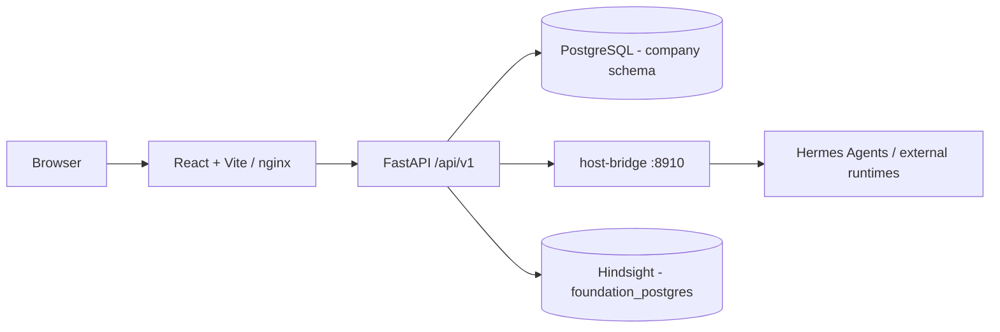

<p align="center">
  
</p>

<p align="center">
  <strong>Control plane for planning, governing, and executing software projects with AI agents.</strong>
</p>

<p align="center">
  <a href="#overview">Overview</a> ·
  <a href="#key-features">Features</a> ·
  <a href="#architecture">Architecture</a> ·
  <a href="#technologies">Technologies</a> ·
  <a href="#installation">Installation</a> ·
  <a href="#documentation">Documentation</a>
</p>

---

## Overview

ForgeHub is the control plane that replaces the former "Hermes Agent Forge" stack for planning, governing, and executing software projects driven by AI agents. The product registers products/versions/projects, defines pipeline stages with mandatory artifacts and approval gates, breaks planning items (features, bugs, etc.) down into tasks, dispatches those tasks to executor agents, and keeps an audit trail linking every entity back to a product version.

The core invariant of the domain: no feature, bug, task, skill, execution, or artifact can exist without a link to a product, version, project, planning item, pipeline, owner, status, audit trail, and validation criteria. Most tables exist to preserve this traceability chain, not merely to store data.

All communication and task execution between agents happens through a single channel — **Messages** (`company.agent_demands`) — accessible from the product's screen, a dedicated MCP server (`forgehub`), or the `send_agent_message.sh` script. There is no longer any integration with external task-board tools (Kanboard was discontinued and removed from the code on 2026-07-28).

In manual composition, **From (agent)** must always identify the agent responsible for the message. **To** may be left blank: in that case, the work is addressed to the **From** agent itself. The type is always explicit and limited to `Task` or `Incubation`; a `Task` with no recipient specified uses the sender as the recipient and is scheduled immediately when no time is chosen.

## Key Features

- **Product and pipeline governance** — registration of products, versions, and projects; definition of pipeline stages with mandatory artifacts and approval gates before work can move forward.
- **Planning → execution traceability** — breaking down features/bugs into tasks, assignment to agents, dependencies between tasks (a blocking gate at dispatch), and per-agent execution telemetry.
- **Product → Project Cockpit** — an aggregated tree with the five phases of the Software Factory (Concept, System Map, Backlog/Planning, Tasks, Governance) and per-project cost.
- **Messages channel (agent ↔ agent and task execution)** — every task dispatch goes through the same message channel, with a dispatch timeout, a concurrency cap, manual reprocessing of failures, and optional Telegram feedback.
- **Incubation** — messages with no immediate execution stay "parked" until the owning agent decides to receive them (they become a Task) or discard them, with an automatic maturation deadline.
- **Agent registry** — executor/coordinator agents, sub-agents, skills, revocable service credentials, profile files (SOUL.md/IDENTITY.md/...), per-runtime MCP servers, and Telegram channel status.
- **Audit trail and governance** — approvals and audit events as first-class entities, with a polymorphic reference (entity_type/entity_id).
- **Inbox/Docs/Chat** — an intake channel convertible into a task/doc/artifact/planning item; a Markdown documentation area; chat with SSE streaming to the Hermes agents.
- **Operational tools** — cron jobs, scripts, database exploration, Hindsight (memory) status, Git/system control, and server inventory (with an encrypted SSH key vault).

## Architecture

```text
Frontend (React/Vite)
   │  fetch same-origin (VITE_API_URL || window.location.origin)
   ▼
Backend (FastAPI, /api/v1/*)
   │
   ├── PostgreSQL "company" schema (company_postgres:5433) — ForgeHub data
   ├── PostgreSQL "foundation" (foundation_postgres:5432) — internal Hermes/Hindsight data
   ├── host-bridge (systemd, :8910) — proxy to real Hermes processes on the host
   │      ├── chat streaming (SSE) and agent execution
   │      └── cross-channel messaging gateway (Telegram/Discord/Slack)
   └── Hindsight — collective semantic memory (read-only proxy)
```



The backend follows a **domain-module pattern**: each domain touches exactly three layers —
`db/models/<domain>.py` (SQLAlchemy), `api/schemas/<domain>.py` (Pydantic), and
`api/routes/<domain>.py` (an `APIRouter` owning its own `/api/v1/<resource>` prefix). Cross-domain
foreign keys are declared as strings (`ForeignKey("company.<table>.id")`) to avoid
import-order coupling; all modules are imported centrally in
`app/db/models/__init__.py` (also used by Alembic for autogenerate).

## Technologies

| Layer | Technology |
|---|---|
| Backend | Python 3.13 · FastAPI · SQLAlchemy (async) + asyncpg · Alembic · OAuth2 password flow + JWT (python-jose) · pytest + httpx |
| Frontend | React 18 + Vite · TypeScript · shadcn/ui (Tailwind + Radix, via class-variance-authority/clsx/tailwind-merge) + Framer Motion · TanStack Query + Zustand · React Hook Form + Zod · Vitest + React Testing Library |
| Database | PostgreSQL (pgvector/pg16) — shared instance `company_postgres`, `company` schema |
| Messaging/agents | MCP servers (`host-bridge/forgehub_messages_mcp.py`, `forgehub_macro_mcp.py`, `forgehub_testing_mcp.py`) |
| Diagrams/visualization (frontend) | Mermaid, `@xyflow/react`, `force-graph`/`3d-force-graph`, `markmap`, `@excalidraw/excalidraw`, `@xterm/xterm` |
| Containerization | Docker + Docker Compose (shared external network `foundation_network`) |
| LLM proxy | ForgeRouter (external service, not part of this repository, integrated via SSO/API key) |

See [`docs/reference/TECHNOLOGY.md`](docs/reference/TECHNOLOGY.md) for the complete, authoritative reference of the stack (supersedes sections §2/§3.2 of [`docs/specs/SPEC.md`](docs/specs/SPEC.md), which describe an outdated C#/ASP.NET Core stack).

## Project Structure

```text
forgehub/
├── backend/
│   ├── app/
│   │   ├── api/routes/       # ~45 domain routers (product, task, demand, agent, ...)
│   │   ├── api/schemas/      # Pydantic schemas per domain
│   │   ├── db/models/        # SQLAlchemy models per domain
│   │   ├── core/             # config, security, feedback, agent_runs, etc.
│   │   ├── tests/            # pytest + httpx against the real app and real DB
│   │   └── main.py           # FastAPI entrypoint, mounts all routers
│   ├── alembic/versions/     # migrations (131 revisions)
│   └── requirements.txt
├── frontend/
│   ├── src/pages/<domain>/  # one folder per domain (index.tsx, [id].tsx, Form)
│   ├── src/hooks/use<Domain>.ts  # TanStack Query hooks (67 files)
│   ├── src/components/ui/    # shadcn/ui primitives
│   ├── src/i18n/locales/     # en, pt-BR, es (partial)
│   └── nginx.conf            # proxy /api -> forgehub-backend:8000 (Docker deploy)
├── host-bridge/               # systemd process on host: SSE chat, MCP servers, messaging
├── database/postgres-company/ # docs/definition of the shared Postgres container
├── docs/                      # development documentation (see docs/README.md)
├── help/                      # end-user manual and operational guides
├── docker-compose.yml         # backend + frontend + hindsight, foundation_network network
└── dev.sh                     # development launcher (hot-reload, no Docker)
```

## Prerequisites

- Python 3.13+
- Node.js/npm (Vite/React 18)
- A reachable PostgreSQL instance (pgvector/pg16), configured via `.env` at the repository root — see [`docs/reference/DB_README.md`](docs/reference/DB_README.md)
- Docker + Docker Compose — only needed for the containerized deploy path

## Installation

```bash
git clone <REPOSITORY_URL>
cd forgehub
```

> The `origin` configured in this checkout points to the author's private GitHub repository; replace it with the URL of your own fork/remote.

`dev.sh` automatically checks for `.env`, `backend/.venv`, and `frontend/node_modules`, creating/installing whatever is missing in a fresh checkout — you don't need to run the manual steps below if you're using `./dev.sh`.

### Backend (manual, if not using `dev.sh`)

```bash
cd backend
python -m venv .venv && source .venv/bin/activate
pip install -r requirements.txt
```

### Frontend (manual)

```bash
cd frontend
npm install
```

## Configuration

There is no versioned `.env.example` in this repository; the variables below (read by `backend/app/core/config.py`, via `pydantic-settings`) must be defined in a `.env` file at the root:

| Variable | Required | Description |
|---|---:|---|
| `POSTGRES_HOST` | No (default `localhost`) | Main PostgreSQL host |
| `POSTGRES_PORT` | No (default `5433`) | Main PostgreSQL port |
| `POSTGRES_USER` | No (default `foundation`) | PostgreSQL user |
| `POSTGRES_PASSWORD` | Yes | PostgreSQL password |
| `POSTGRES_DB` | No (default `forgehub`) | Database name |
| `POSTGRES_SCHEMA` | No (default `company`) | Schema used by all models |
| `JWT_SECRET` | Yes (production) | JWT token signing key — the default is insecure and for dev only |
| `DEV_USER_USERNAME` / `DEV_USER_PASSWORD` | No | Credentials for the single hardcoded user in the auth placeholder |
| `CHAT_BRIDGE_URL` / `CHAT_BRIDGE_TOKEN` | Yes (for chat/dispatch) | Address and token of the host-bridge (proxy to real Hermes processes) |
| `FORGEROUTER_URL` / `FORGEROUTER_SSO_SECRET` | No | SSO integration with ForgeRouter (LLM proxy) |
| `FOUNDATION_POSTGRES_HOST` | No (default `foundation_postgres`) | Second Postgres instance (internal Hermes/Hindsight data) |
| `HINDSIGHT_API_LLM_API_KEY` | Yes (for the compose's `hindsight` service) | LLM key used by Hindsight via ForgeRouter |
| `MESSAGE_ATTACHMENTS_ROOT` | No (default `/messages`) | Directory where message attachments are written |

```env
POSTGRES_PASSWORD=<POSTGRES_PASSWORD>
JWT_SECRET=<JWT_SECRET>
CHAT_BRIDGE_TOKEN=<CHAT_BRIDGE_TOKEN>
HINDSIGHT_API_LLM_API_KEY=<HINDSIGHT_API_LLM_API_KEY>
```

## Running the Project

### Development (recommended — no Docker rebuild per change)

```bash
./dev.sh            # backend on :8001 (uvicorn --reload) + frontend on :5172 (vite dev)
./dev.sh status      # what's currently running
./dev.sh stop        # stops both
./dev.sh restart     # stop + start
```

Ports deliberately different from the Docker deploy (8000/4173) so both can run at the same time. `dev.sh` never kills a process it didn't start: it stops whatever is actually listening on the port (`lsof`), not a captured PID.

### Production / Docker

```bash
docker compose up -d --build
curl http://localhost:8000/health        # → {"status":"ok"}
```

The compose brings up three services: `forgehub-backend` (:8000), `forgehub-frontend` (:4173, nginx serving the build), and `hindsight` (:8888/:9999). All of them share the external network `foundation_network` (created manually with `docker network create foundation_network`), the same one used by `company_postgres`/`foundation_postgres`. The backend depends on multiple host bind mounts (Knowledge Base, Hermes profiles, Docs area, message attachments, the full `/` for the "creation areas") — see the comments in [`docker-compose.yml`](docker-compose.yml).

## Application Access

| Service | Dev (`dev.sh`) | Docker |
|---|---|---|
| Frontend | `http://localhost:5172` | `http://localhost:4173` |
| Backend / health | `http://localhost:8001/health` | `http://localhost:8000/health` |
| Interactive API documentation (Swagger) | `http://localhost:8001/docs` | `http://localhost:8000/docs` |

## API

- Base: `/api/v1/*`, each domain owns its own prefix (e.g., `/api/v1/products`, `/api/v1/tasks`, `/api/v1/demands`).
- Authentication: OAuth2 password flow + JWT (`POST /api/v1/auth/token`), validated by a global `RequireAuthMiddleware`; a small set of routes remains public out of structural necessity (login, task/demand submission by an agent via bridge token, an agent's pull queue).
- Live documentation: `/docs` (Swagger UI) and `/redoc`, auto-generated by FastAPI.
- About 45 domain routers are mounted in `backend/app/main.py` — not fully reproduced here since it's already available in Swagger.

```http
POST /api/v1/auth/token
GET  /api/v1/products
GET  /api/v1/tasks
POST /api/v1/tasks/{id}/dispatch
POST /api/v1/demands/submit
```

## Database

```bash
cd backend
alembic upgrade head                              # applies the 131 existing migrations
alembic revision --autogenerate -m "<message>"   # new migration (reads app/db/models/__init__.py)
```

All application tables live in the `company` schema of the shared instance `company_postgres` (port 5433) — never in `public` nor in the `foundation_postgres` instance (reserved for internal Hermes/Hindsight data). Topology details in [`docs/reference/DB_README.md`](docs/reference/DB_README.md) and the entity dictionary in [`docs/reference/DATA_MODEL.md`](docs/reference/DATA_MODEL.md).

## Security

- Authentication via OAuth2 password flow + JWT (`python-jose`), with a global `RequireAuthMiddleware` and an explicit allowlist for the few structurally public endpoints.
- `auth.py` is an **explicit placeholder**: it validates against a single fixed user (`DEV_USER_USERNAME`/`DEV_USER_PASSWORD`), with no real Users/Auth domain — out of scope at the product's current stage.
- Sensitive secrets (SSH private keys in `server.py`, per-agent ForgeRouter API key) are encrypted at rest via `core/secrets.py` (Fernet) before reaching the database; no endpoint returns the plaintext value, only a "configured" boolean.
- Bridge-token routes (used by agents/MCP) validate the token within the route itself, with explicit carve-outs in the middleware for dynamic paths (`/demands/{id}/...`).
- CORS enabled via `CORSMiddleware` (see `backend/app/main.py`).

There is no formal security assessment published in this repository; treat the points above as what is implemented, not as a "production-ready" certification.

## Tests

```bash
# Backend — pytest + httpx against the real FastAPI app and the real database (no mocks/transaction rollback)
cd backend
pytest                                              # all tests (52 files)
pytest app/tests/test_product.py                    # a single domain
pytest app/tests/test_product.py::test_create_get_list_product   # a single test

# Frontend — Vitest + React Testing Library (jsdom environment)
cd frontend
npm test
```

Backend tests require migrations to have already been applied (the tables need to exist), and each test creates/cleans up its own data (usually with a UUID suffix) in a `finally`.

## Code Quality

```bash
cd backend
ruff check app        # Python lint (ruff.toml: Pyflakes + rule B904)
```

There is no ESLint/Prettier configuration on the frontend in this repository; `npm run build` runs `tsc -b` before the Vite build, acting as type checking.

## Deployment

The only deployment mechanism present in the repository is `docker compose up -d --build` (see section above). There are no CI/CD workflows (`.github/`), Kubernetes, Terraform, or Ansible in this repository.

## Observability

- `GET /health` on the backend, used by Docker Compose's own healthcheck.
- The **System Control** page exposes the repository's git status/last commit and triggers a compressed backup of `/root/.hermes` via host-bridge.
- The **Hindsight** page exposes the memory daemon's status/logs (via host-bridge), with admin restart and log-clearing.
- Per-agent execution telemetry (`GET /api/v1/factory/agent-telemetry`) and per-project cost in the Cockpit, aggregated from `TaskExecution`/`TaskAssignment`/`AgentDemand`.

## Contribution

The repository documents contribution conventions in [`AGENTS.md`](AGENTS.md) (structure, commands, code style, tests, and commit/PR messages). Basic flow:

```bash
git checkout -b feature/FEATURE_NAME
git commit -m "feat: description"
git push origin feature/FEATURE_NAME
```

## License

No license file was found in the repository.

## Documentation

| Document | Content |
|---|---|
| [`docs/README.md`](docs/README.md) | Map and authority hierarchy of all development documentation |
| [`docs/specs/PRD.md`](docs/specs/PRD.md) | Original product vision, journeys, definition of done (historical baseline) |
| [`docs/specs/SPEC.md`](docs/specs/SPEC.md) | Original domain model, entities, and business rules (stack §2/§3.2 is outdated) |
| [`docs/reference/TECHNOLOGY.md`](docs/reference/TECHNOLOGY.md) | Implemented technology stack (canonical) |
| [`docs/reference/DATA_MODEL.md`](docs/reference/DATA_MODEL.md) | Dictionary of implemented entities |
| [`docs/reference/BUSINESS_RULES.md`](docs/reference/BUSINESS_RULES.md) | Business rules applied today |
| [`docs/reference/DB_README.md`](docs/reference/DB_README.md) | Database topology and connection configuration |
| [`docs/architecture/`](docs/architecture) | Target architecture, agent execution protocol, implementation readiness |
| [`help/MANUAL.md`](help/MANUAL.md) | End-user operational manual |
| [`help/TECH_STACK_GUIDE.md`](help/TECH_STACK_GUIDE.md) | Technology stack guide for the products ForgeHub manages |
| [`AGENTS.md`](AGENTS.md) | Structure, build, test, and commit conventions for contributors |
| `http://localhost:8001/docs` (dev) or `:8000/docs` (Docker) | Interactive API reference (Swagger, generated by FastAPI) |
