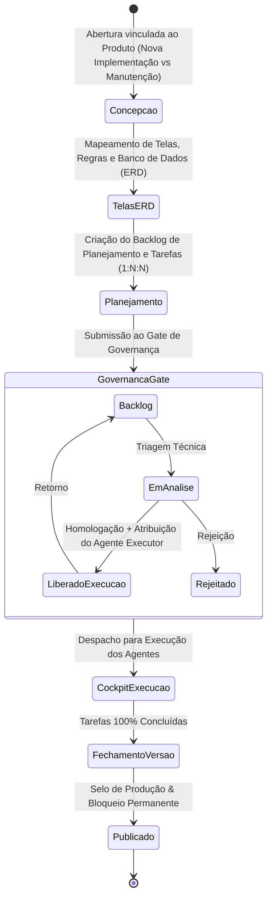

# Software Factory — Pipeline de Desenvolvimento AI-SDLC e Governança

## 1. Visão do Ciclo de Vida

A Software Factory do ForgeHub implementa um ciclo de desenvolvimento de software assistido por inteligência artificial (AI-SDLC) com controle humano estrito.

---

## 2. Detalhamento dos Módulos e Telas

### Módulo 1: Concepção (`/conception`)
- **Associação ao Produto**: Permite selecionar um Produto existente ou cadastrar um novo.
- **Tipo de Demanda**:
  - `🚀 Nova Implementação`: Expansão funcional, novo subsistema ou evolução de versão.
  - `🔧 Manutenção`: Correção de defeitos, sustentação ou otimizações.
- **Stack & Multi-Projetos**: Escolha de tecnologias para Frontend, Backend, Database e Deploy, desdobrando em 1 ou mais Projetos executáveis (ex: Web App e Mobile App).

### Módulo 2: Telas & Regras (`/screen-inspector`)
- Catalogação de componentes visuais, formulários, rotas e regras de negócio específicas de cada projeto.

### Módulo 3: Banco de Dados & ERD (`/concept-erd`)
- Diagramação e especificação formal de schemas, tabelas, campos, chaves primárias/estrangeiras e relacionamentos.

### Módulo 4: Central de Projetos & Backlog (`/projects`)
- Navegação Master-Detail vinculada a 1 Projeto ativo.
- Visualização dos N itens de planejamento e suas respectivas N tarefas de execução.
- Filtros por categoria: *Todos, Abertos, Em Execução, Finalizados, Com Bloqueio / Erro*.

### Módulo 5: Gate de Governança (`/governance`)
- Aba dedicada **Gate de Planejamento**.
- Transições de estado determinísticas:
  - `📋 No Backlog` (`new`)
  - `⏳ Em Análise` (`triaged` / `scoped`)
  - `✓ Liberado para Execução` (`in_progress`): Requer seleção do **Agente Executor**.
  - `✗ Rejeitado` (`rejected`)
  - `⛔ Bloqueado` (`blocked`)

### Módulo 6: Cockpit de Execução (`/cockpit`)
- Acompanhamento visual da esteira em tempo real, monitoramento das tarefas em andamento e auditabilidade dos agentes.

### Módulo 7: Fechamento de Versão & Produção (`/version-closure`)
- Auditoria integral da `ProductVersion`: o botão de publicação só é liberado quando existe ao menos uma tarefa e todas as tarefas de todos os projetos da versão estiverem terminais (`done`, `deployed` ou `cancelled`).
- Ao publicar a versão, o projeto passa para o status `completed` e todos os itens de planejamento para `done`, travando o projeto contra qualquer alteração futura.

---

## 3. Integração com Agentes de IA (MCP `forgehub`)

Os agentes operam através do servidor MCP unificado `forgehub` (`backend/app/mcp/factory_server.py`), utilizando as ferramentas:
- `get_project_context`, `list_project_screens`, `get_project_erd` para leitura de contexto;
- `list_planning_items`, `list_project_tasks`, `update_task_status` para execução de trabalho;
- `report_governance_blocker` para acionamento do operador em caso de impedimentos.

O servidor reutiliza as 12 ferramentas canônicas do MCP de Messages e adiciona
as 9 ferramentas da Software Factory. Leituras da Factory e atualização de
task exigem `FORGEHUB_AGENT_TOKEN` (`AgentServiceCredential` com prefixo
`agt_`); a atualização de task também passa por delegação
`planning.execution.manage`. Falhas HTTP são retornadas como erro da
ferramenta — nunca como lista vazia ou sucesso sintético. Bloqueios de
governança geram um registro real em Messages, ligado à concepção/projeto,
sem fabricar aprovação ou alterar silenciosamente o planejamento.
